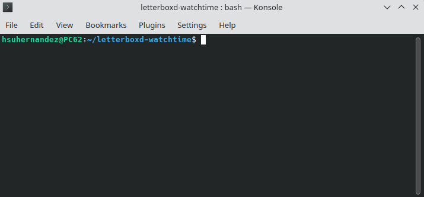

# Letterboxd Watchlist Summary

A small Python script that calculates how long it would take to watch every movie in a Letterboxd watchlist.

The script fetches all films from a user's watchlist and retrieves each film's runtime to compute:
- Total time required to watch the entire watchlist
- Average runtime per movie

## Features
- Fetches movies from a Letterboxd user's watchlist.
- Calculates total and average watch times.
- Outputs results in a user-friendly format.

## Requirements
- Python 3.7+
- Libraries: `requests`, `beautifulsoup4`, `tqdm`

## Installation
1. Clone this repository:
   ```bash
   git clone https://github.com/hsuhernandez/letterboxd-watchtime.git
   ```
2. Navigate to the project directory:
   ```bash
   cd letterboxd-watchtime
   ```
3. Install the required dependencies:
   ```bash
   pip install -r requirements.txt
   ```

## Usage
Run the script with the following command:
```bash
python letterboxd_watchtime.py --delay 0.3
```

### Arguments
- `username`: Letterboxd username (without `@`).
- `--delay`: Pause between movie requests (default: 0.1 seconds).

## Example
```bash
python letterboxd_watchtime.py hugosachah --delay 0.1
```
## Example output
```
Processing 83 movies, this may take a while...
Analyzing movies: 100%|██████████████████████| 83/83 [00:44<00:00,  1.85movie/s]
Time needed to watch all the movies: 6 days, 22 hours and 54 minutes
Average time per movie: 2 hours, 0 minutes and 39 seconds
```

## Demo
<p align="center">
  
</p>

## Disclaimer
This project is an unofficial utility and is not affiliated with Letterboxd.